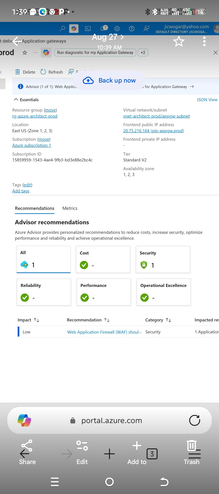
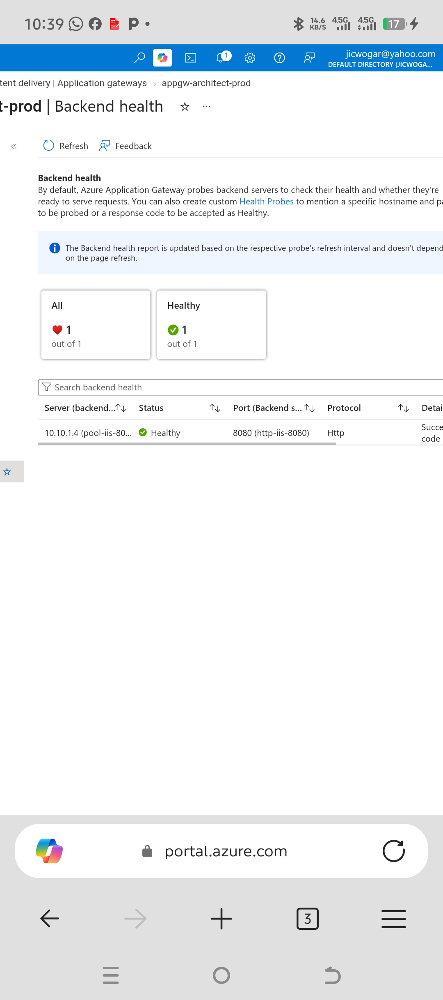
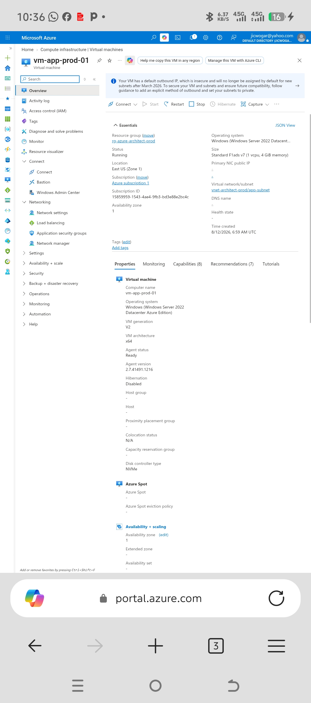
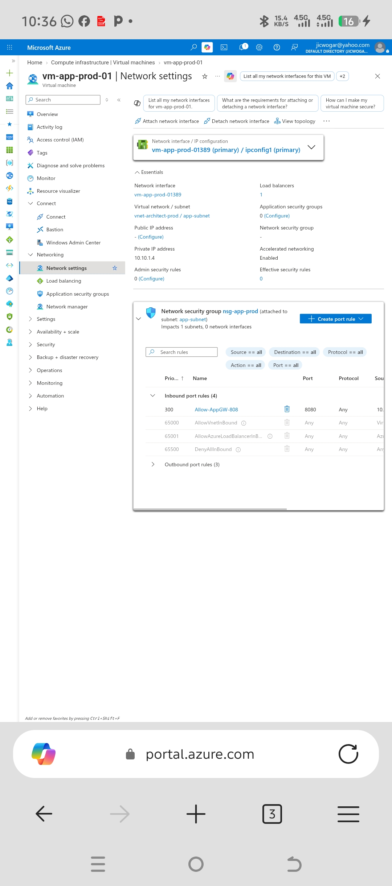
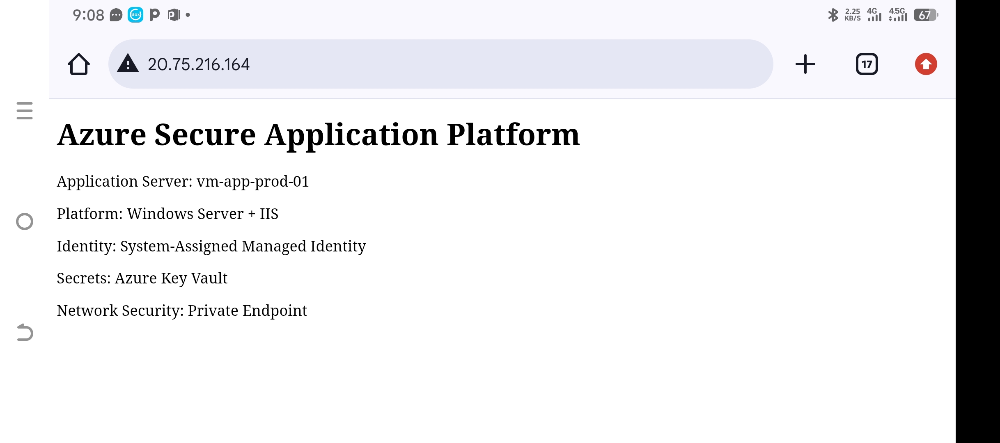

# Enterprise Azure Application Architecture & Secure Delivery Infrastructure
Azure

Windows Server

Security
## Architecture Overview
This project demonstrates an enterprise-grade, highly secure Infrastructure-as-a-Service (IaaS) deployment on Microsoft Azure. The architecture isolates compute workloads inside a private virtual network while exposing applications securely to the internet via an Azure Application Gateway (v2 SKU). Remote operational access to internal compute nodes is strictly restricted to Azure Bastion, eliminating direct public management endpoints.
```
                  [ Public Internet ]
                           │
                           ▼
          [ Application Gateway (Frontend PIP) ]
               20.75.216.164 (Port 80/HTTP)
                           │
             (Health Probe: HTTP 8080 Check)
                           │
                           ▼
 ┌─────────────────────────────────────────────────────┐
 │ Virtual Network: vnet-architect-prod (East US)      │
 │                                                     │
 │  ┌────────────────────────┐                         │
 │  │ Subnet: appgw-subnet   │                         │
 │  │  - Application Gateway │                         │
 │  └───────────┬────────────┘                         │
 │              │                                      │
 │              ▼                                      │
 │  ┌────────────────────────┐                         │
 │  │ Subnet: app-subnet     │                         │
 │  │  - NSG: nsg-app-prod   │                         │
 │  │  - VM: vm-app-prod-01  │                         │
 │  │    (Private: 10.10.1.4)│                         │
 │  │    (No Public IP)      │                         │
 │  │    (IIS Port: 8080)    │                         │
 │  └────────────────────────┘                         │
 └─────────────────────────────────────────────────────┘

```
## Technical Infrastructure Details
| Resource Category | Resource Name | Key Configuration Details |
|---|---|---|
| **Resource Group** | rg-azure-architect-prod | Region: East US |
| **Virtual Network** | vnet-architect-prod | IPv4 address space divided into dedicated application & gateway subnets |
| **Application Subnet** | app-subnet | Hosts backend Virtual Machines; guarded by custom Network Security Group |
| **Gateway Subnet** | appgw-subnet | Reserved specifically for regional Application Gateway instance |
| **Compute Instance** | vm-app-prod-01 | **OS:** Windows Server 2022 Datacenter
**Size:** Standard F1ads v7 (1 vCPU, 4 GiB memory)
**Public IP:** None (Fully Private)
**Private IP:** 10.10.1.4 |
| **Application Gateway** | appgw-architect-prod | **SKU:** Standard V2
**Frontend Public IP:** 20.75.216.164 (pip-appgw-prod)
**Backend Pool Port:** HTTP 8080 (pool-iis-8080) |
| **Security Layer** | nsg-app-prod | Rule Allow-AppGW-808 allowing inbound traffic on Port 8080 |
## Network Security & Access Control
 1. **Zero Public IP Compute Strategy:**
   * The backend workload VM (vm-app-prod-01) has **no assigned public IP address**, mitigating direct external attack vectors (RDP brute-force, unauthenticated access).
 2. **Network Security Group (NSG) Filtering:**
   * Inbound traffic on the application subnet is strictly governed via nsg-app-prod.
   * Priority rule Allow-AppGW-808 permits inbound traffic targeted to port 8080 specifically routed from the Application Gateway.
 3. **Secure Administrative Access:**
   * Operational management of the backend VM is established via Azure Bastion host integration, enforcing encrypted PaaS-level web browser connections without publicly exposed administrative interfaces.
## Verification & Architecture Evidence

### 1. Application Gateway Overview & Frontend Provisioning
The Application Gateway (appgw-architect-prod) is provisioned across Availability Zones (1, 2, 3) in East US and bound to public frontend IP 20.75.216.164.



### 2. Backend Health Probe Verification
Custom health probes actively monitor backend health over port 8080. The backend pool target (10.10.1.4) reports a Healthy status.




### 3. Compute Configuration & Isolation
vm-app-prod-01 runs Windows Server 2022 Datacenter with complete network isolation (No Public IP assigned).



## 4. Network Interface & Security Rules

The network interface configuration shows private IP 10.10.1.4 with priority inbound security rule Allow-AppGW-808 attached to nsg-app-prod.

### 5. Live Application Delivery

The custom portfolio application loaded through the public frontend IP of the Application Gateway.

## Key Achievements & Security Best Practices

 * **Secure Ingress Traffic Routing:** Offloaded external HTTP traffic from the public boundary to isolated backend IIS servers operating on custom port 8080.
 * **Workload Boundary Isolation:** Ensured complete isolation of operational workloads behind Layer 7 gateway reverse proxy rules.
 * **Future Security Hardening:** Evaluated Azure Advisor recommendations to upgrade Application Gateway to WAF_v2 for OWASP top-10 protective filtering at ingress.
 * 
